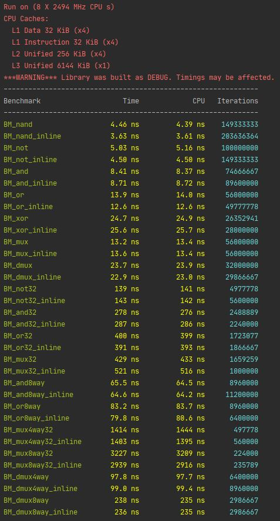

# _nand computer
Creating a computer from the very first principles - both software and hardware. 

All the computation is based on the chip Nand. 

Based on [Nand2Tetris](https://www.nand2tetris.org/) 

## Hardware
Currently implemented chips: 

`BasicGates`: Nand, Not, And, Or, Xor, Mux, DMux, IsZero, IsNZero as well as their multi-bit and multi-way versions.

`Adders`: Half adder, Full adder, Add32, Inc32.
`ALU`: Arithmetical Logical Unit

## Testing
Correctness is tested using Google Tests. 

 

Performance is tested using Google Benchmark. 

 
