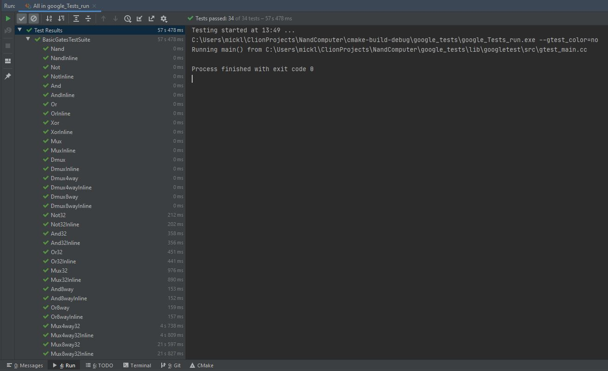

# _nand computer
Creating a computer from the very first principles - both software and hardware. <p>
All the computation is based on the chip Nand. <p>
Based on [Nand2Tetris](https://www.nand2tetris.org/) <p>

## Hardware
Currently implemented 
- `Hardware::BasicGates` - Not, And, Or, Xor etc.
- `Hardware::Adders` - HalfAdder, FullAdder etc.
- `Hardware::ALU` - Arithmetical Logical Unit
- `Hardware::SequentialChips` - FlipFlops, Register, RAM, Counter etc.
<p>
The list of the implemented chips and their performance can be found below.

## Testing
Correctness is tested using Google Tests. <p>
 <p>
Performance is tested using Google Benchmark. <p>

```
---------------------------------------------------------
Benchmark                                         Time 
---------------------------------------------------------
BasicGates_nand                                  2.80 ns 
BasicGates_nand_v2                               3.07 ns 
BasicGates_nand3way                              3.35 ns 
BasicGates_nand_v3                               3.46 ns 
BasicGates_not                                   4    ns 
BasicGates_and                                   6.6  ns 
BasicGates_or                                    8.1  ns 
BasicGates_xor                                  10.5  ns 
BasicGates_mux                                  10.3  ns 
BasicGates_xnor                                 13.9  ns 
BasicGates_dmux                                 16.8  ns 
BasicGates_and8way                              52.4  ns 
BasicGates_or8way                               55.4  ns 
BasicGates_not16                                61    ns
BasicGates_dmux4way                             69    ns 
BasicGates_and16                               106    ns
BasicGates_is_nzero16                          116    ns
BasicGates_is_zero16                           121    ns
BasicGates_not32                               121    ns 
BasicGates_or16                                129    ns
BasicGates_mux16                               165    ns
BasicGates_dmux8way                            175    ns 
BasicGates_and32                               212    ns 
BasicGates_is_nzero32                          235    ns 
BasicGates_is_zero32                           240    ns 
BasicGates_or32                                261    ns 
BasicGates_mux32                               329    ns 
BasicGates_mux4way16                           495    ns
BasicGates_mux4way32                           980    ns 
BasicGates_mux8way16                         1'164    ns
BasicGates_mux8way32                         2'300    ns 
                                            
Adders_half_adder                               13    ns 
Adders_full_adder                               23    ns 
Adders_inc16                                   408    ns    
Adders_add16                                   557    ns    
Adders_inc32                                   816    ns 
Adders_add32                                 1'140    ns 
                                            
ALU_neg_if16                                   165    ns  
ALU_prepare16                                  175    ns  
ALU_alu                                      1'425    ns    
                                            
SequentialChips_bit_read                         3.65 ns 
SequentialChips_dff                             20.6  ns 
SequentialChips_bit_write                       60    ns 
SequentialChips_register16read                  96    ns    
SequentialChips_counter16read                   98    ns    
SequentialChips_register32_read                185    ns 
SequentialChips_counter32_read                 187    ns  
SequentialChips_register16write                991    ns    
SequentialChips_register32_write             1'970    ns       
SequentialChips_counter16                    2'043    ns    
SequentialChips_counter32                    3'988    ns  

SequentialChips_RAM8read                     1'955    ns    
SequentialChips_RAM8write                    9'443    ns    
SequentialChips_RAM64read                   16'937    ns    
SequentialChips_RAM64write                  76'456    ns    
SequentialChips_RAM512read                 137'737    ns    
SequentialChips_RAM512write                613'338    ns    
SequentialChips_RAM4096read              1'104'111    ns    
SequentialChips_RAM4096write             4'964'358    ns    
SequentialChips_RAM32768read             8'804'520    ns    
SequentialChips_RAM32768write           39'318'610    ns    
```
